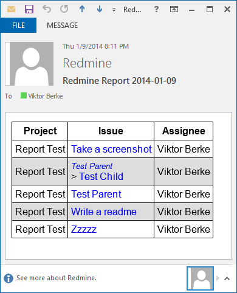

# redmine-digest

### What is it?

It generates and sends email digests about Redmine issues that meet the given criteria (SQL query).

It queries the data to be reported directly from the database so it doesn't bloat your Redmine installation, doesn't require new gems nor does it depend on APIs. It only depends on the database schema.

### Prerequisites?

The following command-line tools on **any** OS which has them:

 * sh
 * mkdir
 * rm
 * wc
 * curl
 * psql (for PostgreSQL) or sqlite3 (for SQLite)

It is tested and works flawlessly on Windows 8.1 (with [Git](http://code.google.com/p/msysgit/downloads/list?q=full+installer+official+git), [pgAdmin](http://www.pgadmin.org/download/windows.php) and [SQLite shell](http://www.sqlite.org/download.html#win32)) and on Ubuntu 12.10/13.10.

### But I use MySQL/SQL Server!

I don't use them thus I can't test them, so patches are welcome. All it would take is just coding and testing the commands for feeding their corresponding command-line tools with the report queries in `query.sh` and `new_report.sh`.

If it's feasible in your setup, you may also try to [migrate](http://vault-tec.info/post/68670739052/installing-migrating-upgrading-redmine-with-ldap-o) to PostgreSQL which is a good idea in any case :)

### How do I use this?

 * Rename `config.sh.example` to `config.sh` and set it up according to your environment.
 * Create a new report config with `./new_report.sh`, it should be self-explanatory.
   * If needed, open `data/report_name` and modify the query (`WHERE` statement) accordingly.
 * Send the report with `./report.sh report_name [subject]`. `report_name` is the name of the report as in the `data` folder and `subject` will be added to the email subject if provided.

### How do I send daily reports automatically?

Add cronjobs (Unix) or scheduled tasks (Windows). See `crontab.example` for examples.

### Why no release?

Because this is just a bunch of shell scripts. You can safely use the [Git version](https://github.com/bviktor/redmine-digest/archive/master.zip).

### More info?

Check out the scripts, they should be straightforward to anyone administering Redmine.

### Alternatives?

[ [1](https://gist.github.com/takus/4177475) ] [ [2](http://www.redmine.org/plugins/digest) ] [ [3](https://github.com/drewkeller/redmine_digest) ] [ [4](http://redminereports.codeplex.com/) ] [ [5](https://github.com/Mon7/redmine-reports) ]
